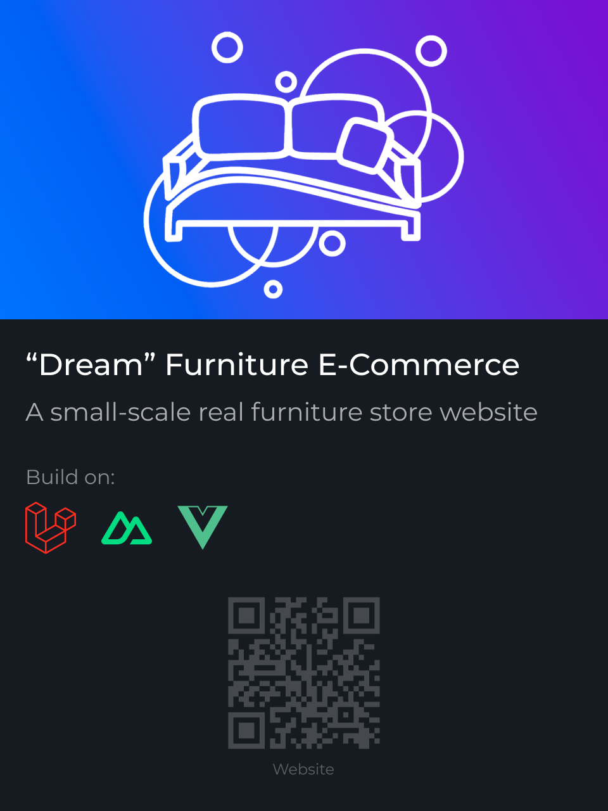
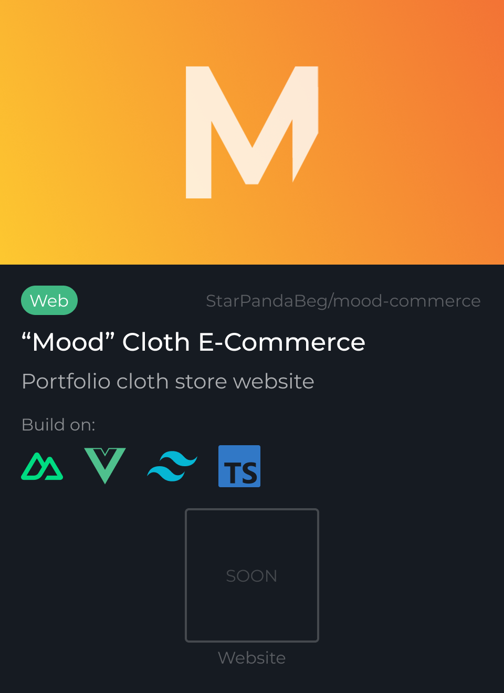
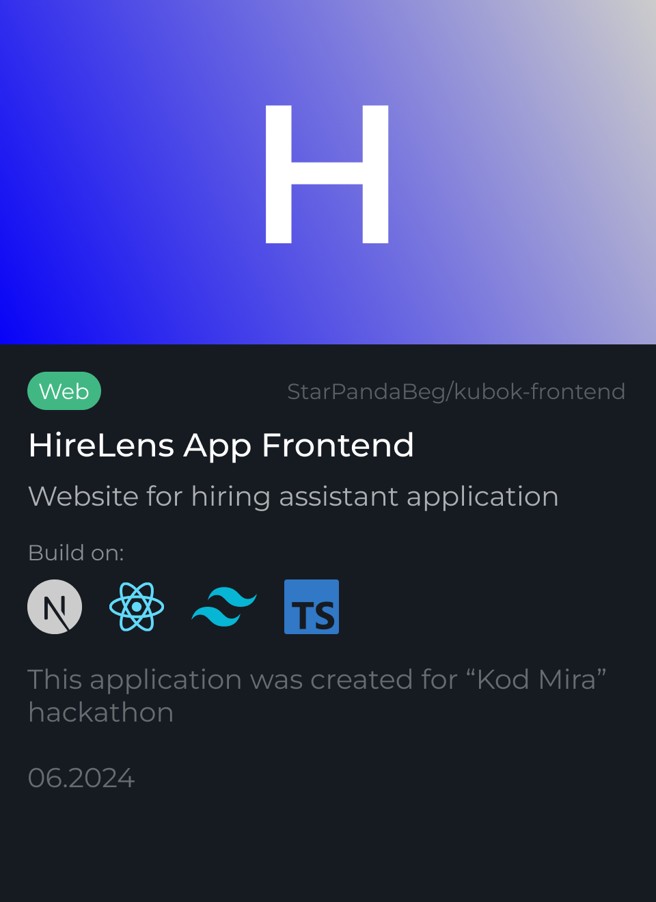
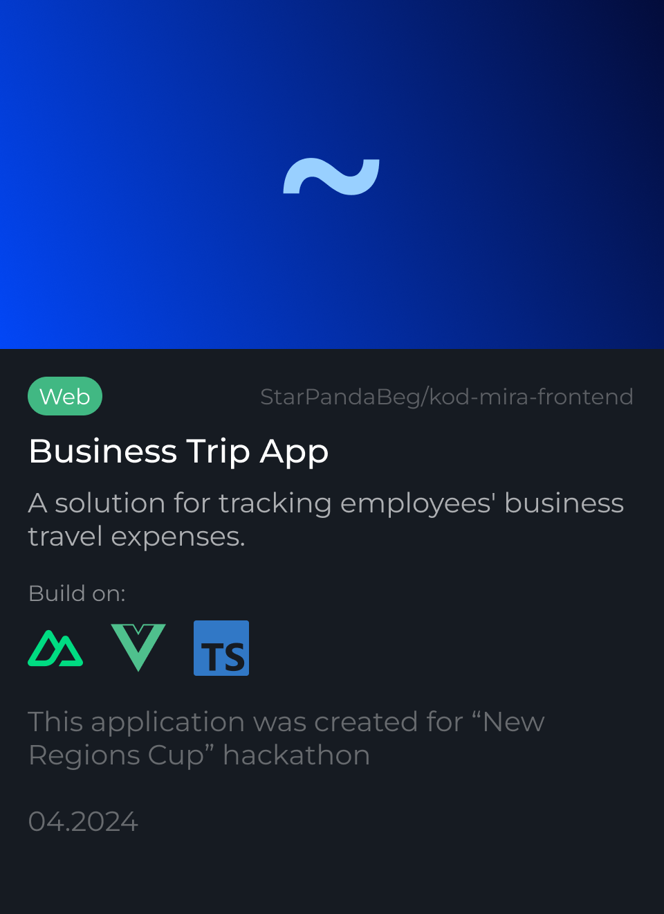
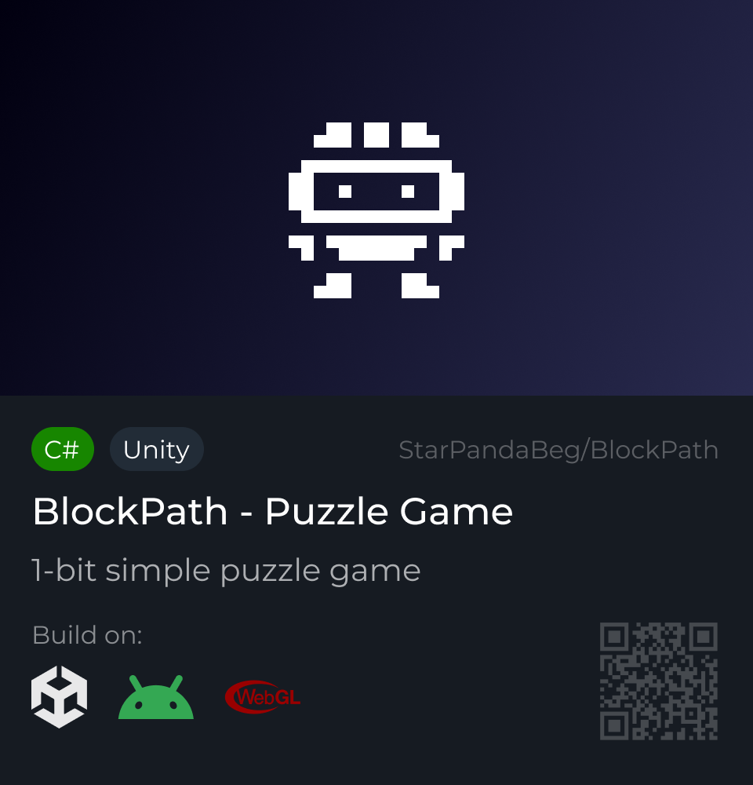
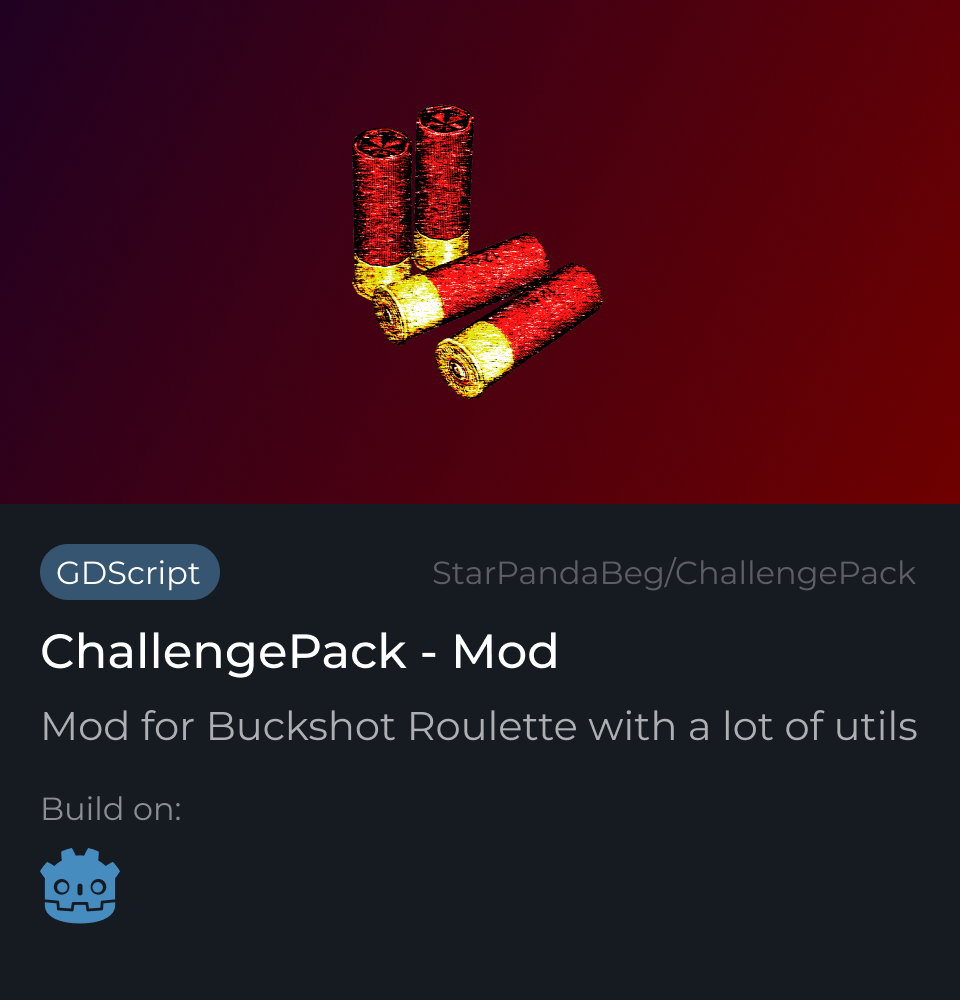
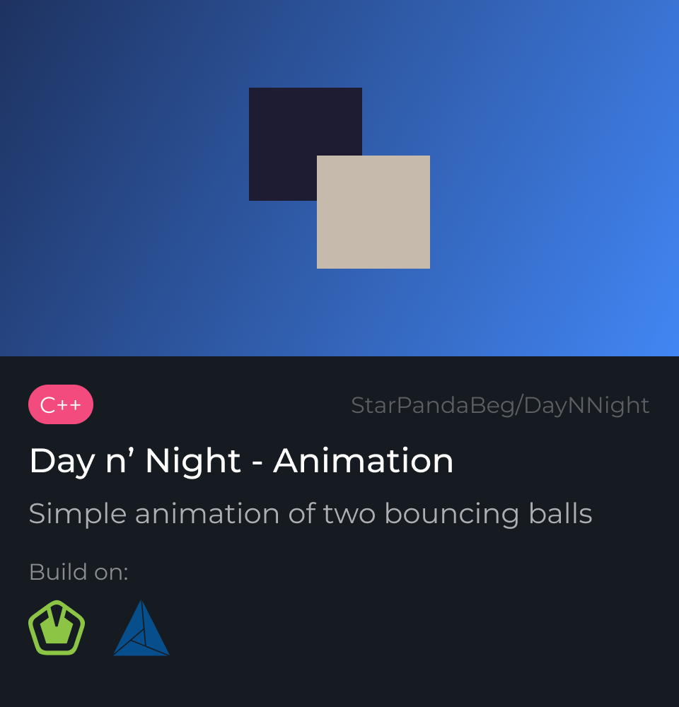
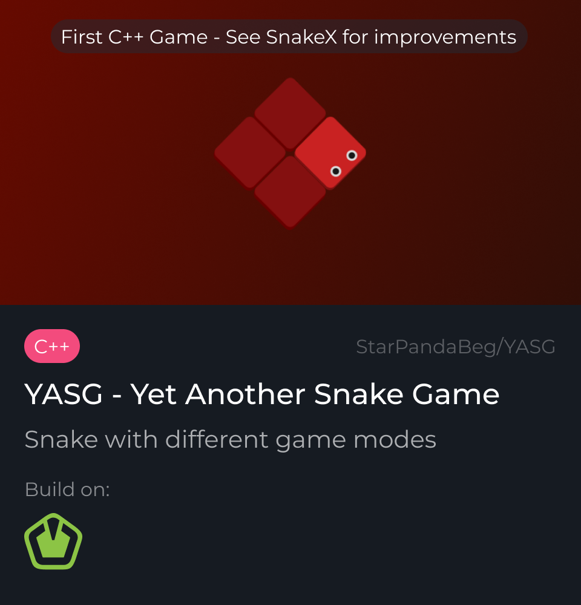

  

<h3 align="center">Hi there 👋, I'm Kostya Shmurakov!</h3>

Junior Software Developer | Node / Vue developer | Web developer

  
  &nbsp;
  

<blockquote>I'm junior developer looking for myself in different development directions. I pay a lot of attention to detail to generate something cool! 😎</blockquote>

<h2>💻 Languages and Tools 🛠️</h2>

  
  
  
  
  
  
  
  

<h2>🌐 Websites</h2>

  
  &nbsp;
  
  &nbsp;
  
  &nbsp;
  

<h2>🎮 Games</h2>

  
  &nbsp;
  
  &nbsp;
  
  &nbsp;
  

 

  
    Icons by 
    <a href="https://icons8.com">Icons8
  

